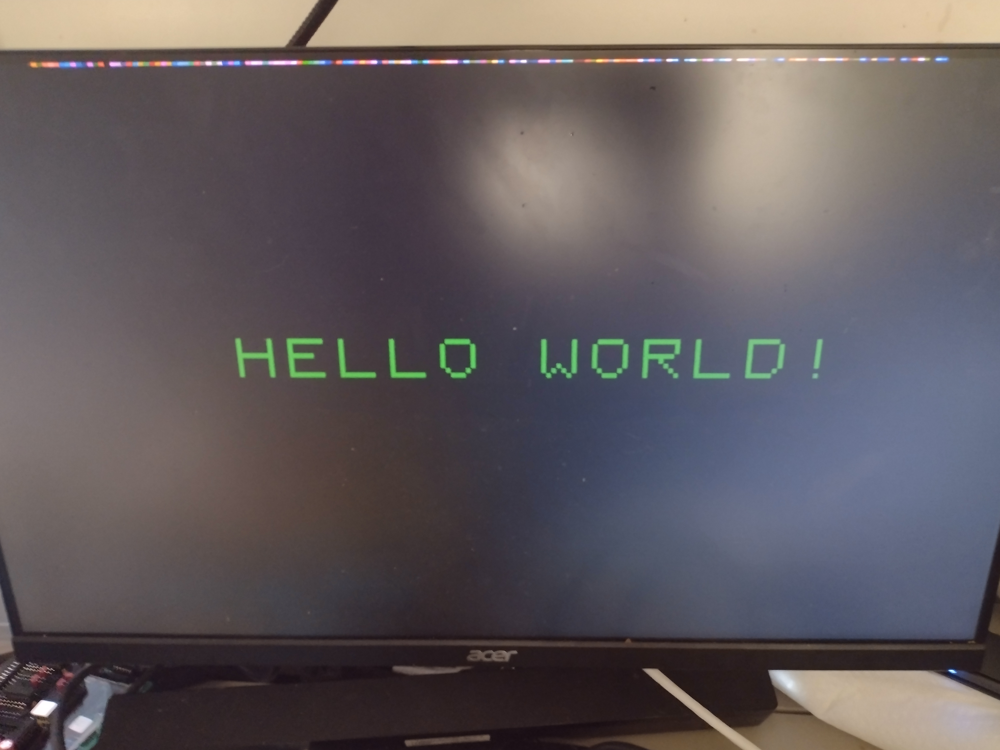

Pi Pico video interface for z80 SBC

I’ve created a video interface for the z80 with a raspberry pi pico. Address selection is accomplished through a 74HCT154 and 74HCT32. Z80 Wait states are triggered when the Pico’s address is decoded via the 74hct32. Currently the Pico implements 4 IO ports - data register (00), x register (01), y register (02), and xy-width register(02). RGB levels come from the other PIO through a resistor DAC. The scanvideo library in pico-extras says it no longer supports 8bpp, so I wrote my own very simple 640x480 video mode fed via DMA. The Pico implements a 160x120 8 bit color output for the z80. 

	I’ve included a very simple and very slow “Hello World” program written in basic-80
	

Much thanks to youtube user Deramp5113, without which I wouldn’t have known where to begin in using my diskless rc 2014 (https://www.youtube.com/watch?v=qSizis0ezck&t=207s). 

Thanks to Dylan from retro-comp for pointing out I’d get spurious IO due to interrupt acknowledge.
Thank you to David Ahl of Creative computing's Basic Computer Games, and Leonard Rosendust for "banner", the source for the basic demo
